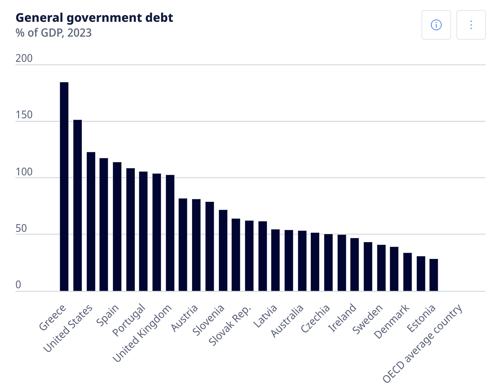

# Part1

# Part2

<noscript></noscript><object class='tableauViz'  style='display:none;'><param name='host_url' value='https%3A%2F%2Fpublic.tableau.com%2F' /> <param name='embed_code_version' value='3' /> <param name='site_root' value='' /><param name='name' value='GeneralGovDebt&#47;Generalgovernmentdebt' /><param name='tabs' value='no' /><param name='toolbar' value='yes' /><param name='static_image' value='https:&#47;&#47;public.tableau.com&#47;static&#47;images&#47;Ge&#47;GeneralGovDebt&#47;Generalgovernmentdebt&#47;1.png' /> <param name='animate_transition' value='yes' /><param name='display_static_image' value='yes' /><param name='display_spinner' value='yes' /><param name='display_overlay' value='yes' /><param name='display_count' value='yes' /><param name='language' value='en-US' /><param name='filter' value='publish=yes' /></object>
               

<noscript></noscript><object class='tableauViz'  style='display:none;'><param name='host_url' value='https%3A%2F%2Fpublic.tableau.com%2F' /> <param name='embed_code_version' value='3' /> <param name='site_root' value='' /><param name='name' value='GeneralGovDebt_1&#47;Generalgovernmentdebt' /><param name='tabs' value='no' /><param name='toolbar' value='yes' /><param name='static_image' value='https:&#47;&#47;public.tableau.com&#47;static&#47;images&#47;Ge&#47;GeneralGovDebt_1&#47;Generalgovernmentdebt&#47;1.png' /> <param name='animate_transition' value='yes' /><param name='display_static_image' value='yes' /><param name='display_spinner' value='yes' /><param name='display_overlay' value='yes' /><param name='display_count' value='yes' /><param name='language' value='en-US' /><param name='filter' value='publish=yes' /></object>
                

# Part 3

<noscript></noscript><object class='tableauViz'  style='display:none;'><param name='host_url' value='https%3A%2F%2Fpublic.tableau.com%2F' /> <param name='embed_code_version' value='3' /> <param name='site_root' value='' /><param name='name' value='GeneralGovDebt_2&#47;Sheet2' /><param name='tabs' value='no' /><param name='toolbar' value='yes' /><param name='static_image' value='https:&#47;&#47;public.tableau.com&#47;static&#47;images&#47;Ge&#47;GeneralGovDebt_2&#47;Sheet2&#47;1.png' /> <param name='animate_transition' value='yes' /><param name='display_static_image' value='yes' /><param name='display_spinner' value='yes' /><param name='display_overlay' value='yes' /><param name='display_count' value='yes' /><param name='language' value='en-US' /></object>
                

To tell a better story about general government debt based on 2019 data, I focused on key countries with high gross debt, significant changes, or relevance, like the USA and Canada, since visualizing all variables would make a spaghetti chart which is hard to read. I used a saturation gradient where darker shades represent higher debt percentages, keeping it simple and avoiding the busy look of multiple colors. The key part is showing the range from low to high debt and changes by years as a percentage of GDP.

I added a source to make sure this data is reliable under the title and caption below explaining GDP: “General government debt is the gross debt of the general government as a percentage of GDP,” along with how this is calculated. Due to inconsistent data collection, I omitted entries that didn’t align with the rest and chose to display data from 2000 onward for a more recent comparison. Labels for countries, along with the x-axis as % of GDP and the y-axis as the year (not time), make it easier to read and interpret.

