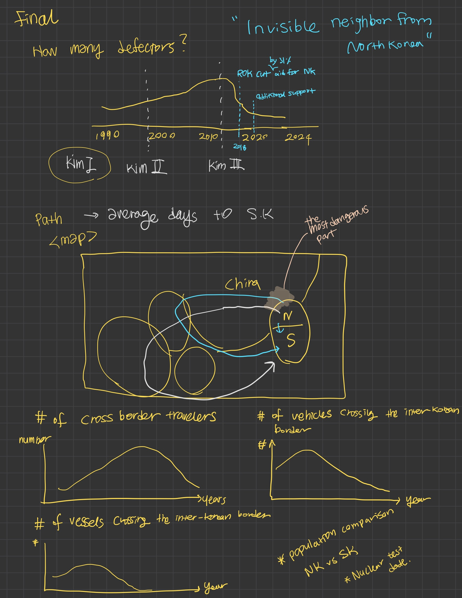

> Important note: this template includes major elements of Part I, but the instructions on Canvas are the authoritative source.  Make sure to read through the assignment page and review the rubric to confirm you have everything you need before submitting.  When done, delete these instructions before submitting.

# Outline

### Title: Invisible Neighbors from North Korea

This project explores the journey of North Korean defectors, focusing on their reasons for escaping, their routes, and their integration into South Korea. Using government data, personal stories, and visualizations, the project seeks to provide a comprehensive understanding of the defection process. The narrative begins with an overview of life in North Korea, characterized by economic instability and political oppression, followed by trends in defection over the years. A map of escape routes will illustrate the paths defectors take, highlighting the time involved in reaching freedom. 

The project also examines the dangers defectors face on the way. Then, I will present data on settlement status, professional and academic backgrounds, and economic activities to highlight the disparities between defectors' previous lives and their new realities. Ultimately, I aim to urge greater support for defectors and raise awareness about their invisible presence in society.

> This project examines North Korean defectors’ escape routes, reasons for leaving, and challenges integrating into South Korea

## Initial sketches
> 

# The data
> My main data source is the Ministry of Unification, a South Korean government department, provides reliable information on North Korean defectors entering South Korea. I’ll also use case studies from articles, U.S. government reports, and UN documents on North Korean defectors.

> ### Bibliography

1. **"'A Sense of Terror Stronger than a Bullet' | Human Rights Watch"**  
   - URL: [https://www.hrw.org/report/2024/03/07/a-sense-of-terror/stronger-than-a-bullet-the-closing-of-north-korea-2018%E2%80%932023](https://www.hrw.org/report/2024/03/07/a-sense-of-terror/stronger-than-a-bullet-the-closing-of-north-korea-2018%E2%80%932023)  

2. **"Charted: The Number of North Korean Defectors (1998-2023)"**  
   - URL: [https://www.visualcapitalist.com/north-korean-defectors-escape-routes/](https://www.visualcapitalist.com/north-korean-defectors-escape-routes/)  

3. **"China Forcibly Returns 60 Refugees to North Korea | Human Rights Watch"**  
   - URL: [https://www.hrw.org/news/2024/05/08/china-forcibly-returns-60-refugees-north-korea](https://www.hrw.org/news/2024/05/08/china-forcibly-returns-60-refugees-north-korea)  

4. **"China Forcibly Returns More than 500 to North Korea | Human Rights Watch"**  
   - URL: [https://www.hrw.org/news/2023/10/12/china-forcibly-returns-more-500-north-korea](https://www.hrw.org/news/2023/10/12/china-forcibly-returns-more-500-north-korea)  

5. **"Number of North Korean Defectors Drops to Lowest Level in Two Decades"**  
   - URL: [https://www.csis.org/analysis/number-north-korean-defectors-drops-lowest-level-two-decades](https://www.csis.org/analysis/number-north-korean-defectors-drops-lowest-level-two-decades)  

6. **"Lawmakers to UN: Suspend China for Repatriating North Korean Defectors | Representative Michelle Steel"**  
   - URL: [http://steel.house.gov/media/in-the-news/lawmakers-un-suspend-china-repatriating-north-korean-defectors](http://steel.house.gov/media/in-the-news/lawmakers-un-suspend-china-repatriating-north-korean-defectors)  

7. **"North Korea - United States Department of State 2022"**  
   - URL: [https://www.state.gov/reports/2022-country-reports-on-human-rights-practices/north-korea/](https://www.state.gov/reports/2022-country-reports-on-human-rights-practices/north-korea/)  

8. **"North Korean Refugees and the Imminent Danger of Forced Repatriation from China | CECC"**  
   - URL: [http://www.cecc.gov/events/hearings/north-korean-refugees-and-the-imminent-danger-of-forced-repatriation-from-china](http://www.cecc.gov/events/hearings/north-korean-refugees-and-the-imminent-danger-of-forced-repatriation-from-china)  

9. **"Commission of Inquiry on Human Rights in the Democratic People’s Republic of Korea"**  
   - URL: [https://www.ohchr.org/en/hr-bodies/hrc/co-idprk/commission-inquiryon-h-rin-dprk](https://www.ohchr.org/en/hr-bodies/hrc/co-idprk/commission-inquiryon-h-rin-dprk)  

10. **"Institutionalised Forced Labour in North Korea Constitutes Grave Violations of Human Rights – UN Report"**  
    - URL: [https://www.ohchr.org/en/press-releases/2024/07/institutionalised-forced-labour-north-korea-constitutes-grave-violations](https://www.ohchr.org/en/press-releases/2024/07/institutionalised-forced-labour-north-korea-constitutes-grave-violations)  

11. **"China Cracks down on North Korean Defectors with Biometric Surveillance"**  
    - URL: [https://www.japantimes.co.jp/news/2024/09/25/asia-pacific/police-surveillance-north-koreans-china/](https://www.japantimes.co.jp/news/2024/09/25/asia-pacific/police-surveillance-north-koreans-china/)  

12. **"North Koreans in China: A Human Rights Analysis"**  
    - URL: [https://www.refworld.org/reference/countryrep/ri/2004/en/53240](https://www.refworld.org/reference/countryrep/ri/2004/en/53240)  

13. **"North Korea - United States Department of State 2023"**  
    - URL: [https://www.state.gov/reports/2023-country-reports-on-human-rights-practices/north-korea/](https://www.state.gov/reports/2023-country-reports-on-human-rights-practices/north-korea/)  

# Bibliography

| Name | URL |
|------|-----|
| "'A Sense of Terror Stronger than a Bullet' | Human Rights Watch" | [https://www.hrw.org/report/2024/03/07/a-sense-of-terror/stronger-than-a-bullet-the-closing-of-north-korea-2018%E2%80%932023](https://www.hrw.org/report/2024/03/07/a-sense-of-terror/stronger-than-a-bullet-the-closing-of-north-korea-2018%E2%80%932023) |
| "Charted: The Number of North Korean Defectors (1998-2023)" | [https://www.visualcapitalist.com/north-korean-defectors-escape-routes/](https://www.visualcapitalist.com/north-korean-defectors-escape-routes/) |
| "China Forcibly Returns 60 Refugees to North Korea | Human Rights Watch" | [https://www.hrw.org/news/2024/05/08/china-forcibly-returns-60-refugees-north-korea](https://www.hrw.org/news/2024/05/08/china-forcibly-returns-60-refugees-north-korea) |
| "China Forcibly Returns More than 500 to North Korea | Human Rights Watch" | [https://www.hrw.org/news/2023/10/12/china-forcibly-returns-more-500-north-korea](https://www.hrw.org/news/2023/10/12/china-forcibly-returns-more-500-north-korea) |
| "Number of North Korean Defectors Drops to Lowest Level in Two Decades" | [https://www.csis.org/analysis/number-north-korean-defectors-drops-lowest-level-two-decades](https://www.csis.org/analysis/number-north-korean-defectors-drops-lowest-level-two-decades) |
| "Lawmakers to UN: Suspend China for Repatriating North Korean Defectors | Representative Michelle Steel" | [http://steel.house.gov/media/in-the-news/lawmakers-un-suspend-china-repatriating-north-korean-defectors](http://steel.house.gov/media/in-the-news/lawmakers-un-suspend-china-repatriating-north-korean-defectors) |
| "North Korea - United States Department of State 2022" | [https://www.state.gov/reports/2022-country-reports-on-human-rights-practices/north-korea/](https://www.state.gov/reports/2022-country-reports-on-human-rights-practices/north-korea/) |
| "North Korean Refugees and the Imminent Danger of Forced Repatriation from China | CECC" | [http://www.cecc.gov/events/hearings/north-korean-refugees-and-the-imminent-danger-of-forced-repatriation-from-china](http://www.cecc.gov/events/hearings/north-korean-refugees-and-the-imminent-danger-of-forced-repatriation-from-china) |
| "Commission of Inquiry on Human Rights in the Democratic People’s Republic of Korea" | [https://www.ohchr.org/en/hr-bodies/hrc/co-idprk/commission-inquiryon-h-rin-dprk](https://www.ohchr.org/en/hr-bodies/hrc/co-idprk/commission-inquiryon-h-rin-dprk) |
| "Institutionalised Forced Labour in North Korea Constitutes Grave Violations of Human Rights – UN Report" | [https://www.ohchr.org/en/press-releases/2024/07/institutionalised-forced-labour-north-korea-constitutes-grave-violations](https://www.ohchr.org/en/press-releases/2024/07/institutionalised-forced-labour-north-korea-constitutes-grave-violations) |
| "China Cracks down on North Korean Defectors with Biometric Surveillance" | [https://www.japantimes.co.jp/news/2024/09/25/asia-pacific/police-surveillance-north-koreans-china/](https://www.japantimes.co.jp/news/2024/09/25/asia-pacific/police-surveillance-north-koreans-china/) |
| "North Koreans in China: A Human Rights Analysis" | [https://www.refworld.org/reference/countryrep/ri/2004/en/53240](https://www.refworld.org/reference/countryrep/ri/2004/en/53240) |
| "North Korea - United States Department of State 2023" | [https://www.state.gov/reports/2023-country-reports-on-human-rights-practices/north-korea/](https://www.state.gov/reports/2023-country-reports-on-human-rights-practices/north-korea/) |

# Method and medium
> I’m using Tableau to create interactive visualizations that make the data clear and easy to explore. With Tableau, I can map out escape routes, show demographic trends, and highlight support systems in South Korea. The goal is to present the data in a way that helps people see the bigger picture without feeling overwhelmed. I will build a story in Shorthand, a multimedia storytelling platform, aiming for seamless data storytelling. 

