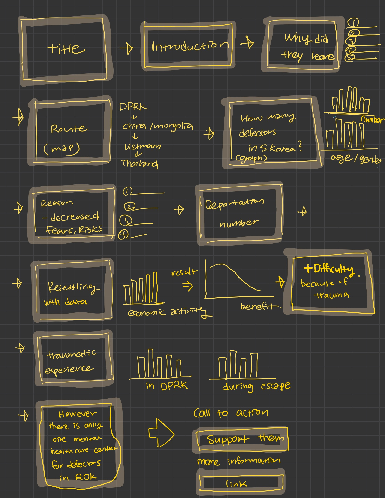

# The final data story
> 
>
> 
>## [Shorthand](https://preview.shorthand.com/jGleKvtHHNr3g0tD) 

# Changes made since Part II

Firstly, I added annotations using Tableau after the presentation because a classmate asked why the number of North Korean defectors has decreased. To make the graph easier to interpret, I included the reasons for the decline, providing clearer context for viewers without heavy text.

I also revised the subtitle “Why Decrease” to “Why Not Increase Again.” This adjustment better aligns with the story by emphasizing the heightened risks and fears resulting from stricter controls at both local and international levels.

In addition, I combined the bar graph and line graph into one graph with multiple lines to highlight the relationship between defectors' resettlement progress and the decrease in their reliance on livelihood benefits. This change simplifies the visual comparison and makes the data more cohesive. Also, I added some contextual information under the graph.

To improve the flow of the story, I decided to remove the age data but combined the gender breakdown with the yearly number of North Korean defectors for a more streamlined

Lastly, I debated whether to add one or two additional sentences for context, but since the story is already long with significant scrolling, I decided to add annotations instead. I felt these annotations were sufficient to provide the necessary context without overloading the audience.

## The audience

There were no specific adjustments for my audience. The target audience for this project includes human rights organizations, and the general public interested in humanitarian issues. I hope to inform individuals who influence or support policies for defectors and to raise awareness among those unfamiliar with their struggles. Therefore, the project focuses on North Korean defectors with their escape routes and traumatic experiences. 

## Final design decisions
> You can specifically break out your design decisions here, or include it under *Changes made since Part II* and delete this section. Talk about the design decisions you had to make along the way, and reflect on anything in particular that stands out to you that you learned working through the process.  Include any other information that helps round out your data story. 

I need to echo ‘Changes made since Part II’. I combined the bar graph and line graph into a single multi-line graph to better highlight the relationship between defectors' resettlement progress and the decrease in their reliance on livelihood benefits. This decision simplifies the visual comparison, creates a cohesive narrative, and makes it easier for the audience to interpret the data. Additionally, I included contextual information below the graph to provide the necessary background and enrich the story.

To emphasize the harsh experiences of defectors, I placed two bar graphs side by side—one showing the trauma experienced in North Korea and the other during their escape. This arrangement draws a clear comparison and creates a stronger emotional impact, helping to highlight the severity of their struggles.

I also learned that color plays a critical role in audience engagement and understanding so I adjusted the color schemes to be more consistent and visually appealing. I ensured the use of a unified color-coding across graphs, enhancing readability and maintaining a professional, cohesive design throughout the story.

# Final thoughts

The Tableau embedded code didn’t work as I wanted in Shorthand, which was really frustrating. I tried to fix it but gave up because of my limited skills. Shorthand was also tricky to use and didn’t always do what I wanted. I think with more practice, I could have done better.
Still, this project was a great opportunity to create a story with data on a topic I’m really interested in. 
