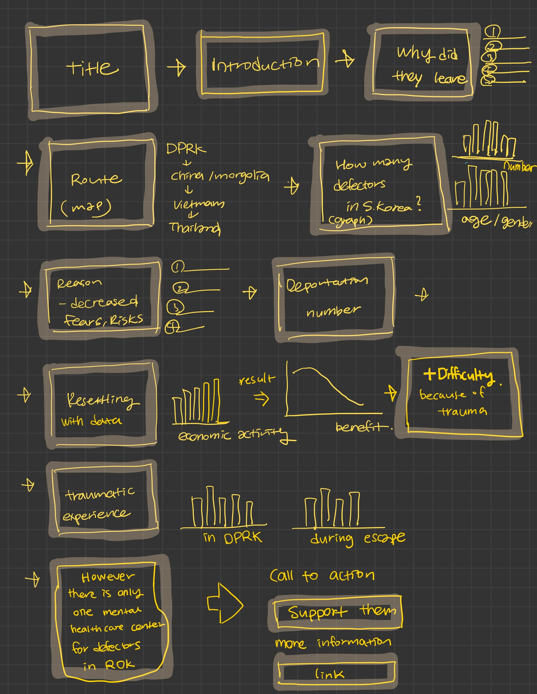

# Wireframes / storyboards
> 

# [Shorthand](https://preview.shorthand.com/jGleKvtHHNr3g0tD) 

# User research 

## Target audience
> The **target audience** for this project includes **human rights organizations**, and **the general public** interested in humanitarian issues and North Korean defectors.

> *I hope to inform individuals who influence or support policies for defectors and to raise awareness among those unfamiliar with their struggles. Therefore, the project focuses on North Korean defectors with their backgrounds, including varying age groups, escape routes, and traumatic experiences. Additionally, the story aims to resonate with advocates for refugee rights and those invested in fostering global empathy and action to support them.*

## Interview script
> 

| Goal                                | Questions to Ask                                                                               |
|-------------------------------------|-----------------------------------------------------------------------------------------------|
| Identify the proper title           | Do you think the title is appropriate and attractive?                                         |
| Identify general background         | Are you interested in or familiar with this topic?                                            |
| Identify understanding of the topic | Do the statistics and data visualization help you to understand exploring the topic?          |
| Identify emotional response         | How do you think this type of story could inform or inspire action?                          |
| Identify engagement and preferences | What do you think needs to be added to this topic?                                            |
| Identify improvement | Which part do you think needs to be improved (barriers)?                                   |

Text here!

## Interview findings
> 

| Questions               | Interview 1                     | Interview 2                                      | Interview 3                                       |
|-------------------------|----------------------------------|-------------------------------------------------|-------------------------------------------------|
| Do you think the title is appropriate and attractive? | Yes, it’s attractive.          | Yes, I want to read, but you may need a subtitle.    | Yes. I like it.                                                 |
| Are you interested in or familiar with this topic?    | Not really.                     | I’ve heard of this, but I don’t know the context.    | I’m not familiar with this topic.                    |
| Do the statistics and data visualization help you to understand exploring the topic? | Yes.                            | Yes, but gender isn’t needed; mix it into the total. | Yes, but the color scheme and background need changes. |
| How do you think this type of story could inform or inspire action? | Definitely!                     | Yes, I would click the support button.               | It is informative.                                   |
| What do you think needs to be added to this topic?    | Some quotes will be helpful.    | I’d like to see the path and distances on the map.   | Add data about mental care for defectors’ communities. |
| Which part do you think needs to be improved (barriers)? | Some quotes will be helpful to engage more.    | Add path details and distances using a map. Add more photos. Add more context.                      | More data on mental care for defectors.              |

# Identified changes for Part III
> ### Research Synthesis & Plan
>From the interviews, I realized the title is clearer than I initially thought, even though I was concerned it might not fully align with the conclusion of the story. Adding a subtitle was suggested as a simple solution to address this concern. I also learned that my data visualizations need adjustments, such as changing the color scheme and removing graphs that don’t directly align with the topic. Personal stories, like quotes, were highlighted as a way to enhance emotional engagement, which I hadn’t focused on enough.
While I had planned to include a map showing paths and distances, I’m struggling with the technical skills to create it, and I’m unsure how to address this feedback effectively. Another key takeaway was the importance of including data on mental health and how it impacts communities. Emphasizing the need for more healthcare centers could serve as a strong call to action and make the story more impactful. I plan to implement all those feedback. 

### Final thoughts
> 

